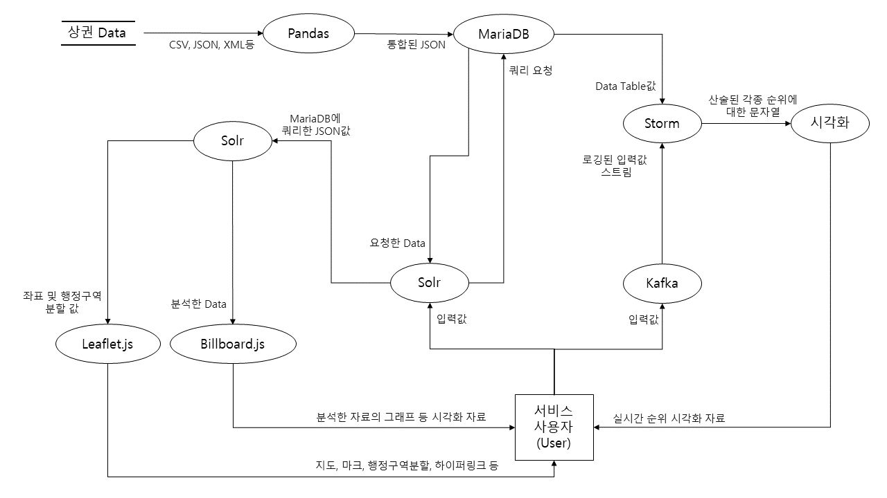

<strong>Ⅰ. 개요</strong>
  
&nbsp; 개인 창업의 수는 7년 전 120만, 현재 140만까지 꾸준히 증가하는 추세이다. 뿐만 아니라 최근 '청년'이라는 키워드의 업체 또는 상권을 심심치 않게 찾아볼 수 있다. 청년층의 창업 관심도 증가와 업종이 다양하게 늘어나고 있어 창업의 정보 수요도 증가할 것으로 사료된다. 따라서 창업의 정보를 얻을 수 있는 '사용자 맞춤형 상권 분석 서비스'를 제공하고자 한다.
 

<strong>Ⅱ. 서비스 간략 소개</strong>
  
&nbsp; '사용자 맞춤 상권 분석 서비스'는 이용자에게 창업에 대한 정보(빅데이터)를 분석하여 제공하는 서비스로, 지역 상권에 대한 정보 분석 자료와 현재 사용자들의 관심사를 토픽별로 모아 실시간 순위를 시각적으로 제공하는 서비스이다.

<strong>Ⅲ. 서비스 상세 소개</strong>
  
&nbsp; 서비스 이용자는 원하고자 하는 지역과 업종을 선택하면, 해당 지역의 상권 정보 분석 자료를 제공받는다. 제공되는 자료로는 '유동인구',
'년도 별 매출과 전년대비 매출 상승률', '시간 별 이용자 수 및 연령대'이다. 해당 자료는 사용자가 쉽게 파악할 수 있도록 그래피 및 도표화한다.
 
&nbsp; 또한 서비스 이용자가 입력한 값들은 실시간으로 데이터를 받아들여 '인기 검색 업종', '선택한 업종의 매출', '매출 상승률 업종' 과 같은 실시간 순위를 제공받는다.

<strong>Ⅳ. 유사 서비스 소개</strong>
  
&nbsp; 이와 유사한 서비스는 '소상공인 시장진흥공단 상권분석 시스템'이다. 해당 서비스는 다음 하이퍼링크를 통해 확인할 수 있다.
<https://sg.sbiz.or.kr/godo/index.sg> 해당 서비스는 이용자가 지도상에서 동 단위로 지역을 설정하고, 분류된 업종을 선택하여 서비스를 제공받는다. 이용자가 제공받는 서비스는 분류별 '간단분석', '상권현황', '상세분석'이다. 간단분석은 해당 동에 위치한 업종들의 매출 평균량, 매출 상승량, 유동인구를 보여주며, 상세분석은 해당 지역에 업종을 창업하였을 때 얻을 수 있는 매출을 확인할 수 있다.

<strong>Ⅴ.유사 서비스의 예상 기술</strong>
  
&nbsp;'소상공인 시장진흥공단 상권분석 시스템'의 예상 기술로는 지도를 통해 직접 동을 찾기 위한 웹 매핑, 분석된 자료를 도표화 하는 UI, 각종 자료를 관리 및 처리를 위한 데이터베이스이다. 또한 각종 웹 서비스를 제공하기위한 서버와 소스코드 및 데이터를 병합시킬 API로 예상된다.

<strong>Ⅵ.설계 예상</strong>
  
&nbsp; 본 서비스의 목적 달성을 위한 데이터 및 오픈소스는 다음과 같다.
 
<li> 연도별 매출, 상권 위치, 유동인구, 행정지역 및 업종 코드 데이터
<li> 검색엔진
<li> 시각화
<li> 실시간 데이터 처리
<li> 관계형 데이터베이스
 
&nbsp; 해당 서비스의 목적은 서비스 이용자에게 상권 분석과 분류별 실시간 업종 순위를 시작적으로 제공함이다. 따라서 상권에 대한 전반적인 데이터와 위치 데이터를 필요로 하고 해당 데이터들을 통합하여 관리할 데이터베이스가 필요할 것이다. 
 
&nbsp;또한 '상권 데이터 분석 결과'와 '실시간 순위'를 위해 검색엔진과 입력 값을 실시간으로 처리하기 위한 소프트웨어, 이를 시각적으로 제공할 오픈소스들이 필요할 것으로 예상한다.

<서비스 설계에 필요한 오픈소스 소개 1~7>  

### Pandas

---

</img>      

pandas는 파이썬 언어로 작성된 데이터를 분석 및 조작하기 위한 소프트웨어 라이브러리이다. 행과 열로 이루어진 데이터 객체를 만들어 다룰 수 있게 되며 보다 안정적으로 대용량의 데이터들을 처리하는데 매우 편리하다.  

라이선스 :  BSD 3-Clause  

Pandas 특징

* 파이썬에서 가장 널리 사용되는 데이터 분석 라이브러리로, R에서 사용되던 data.frame 구조를 본뜬 데이터 프레임(DataFrame) 이라는 자료구조를 사용
* 데이터 프레임은 엑셀의 스프레드시트와 유사한 형태이며 파이썬으로 데이터를 쉽게 처리할 수 있음
* 데이터를 분석 및 조작을 위한 라이브러리 제공
* SQL 같은 일반 데이터베이스처럼 데이터를 합치고 관계연산을 수행하는 기능  

Pandas 선정 이유  

시스템 내 역할  
공공데이터 기관 서울시 열린 데이터 광장에서 서울시 상권, 추정매출, 유동인구 등의 데이터를 csv파일 형태로 제공하는데,

---

# Apache Solr

#### 조사  : 이미나   

</img>
            

---

### 라이선스

Apache License 2.0

---

### Apache Solr 소개

Apache Solr는 Apache Lucene 라이브러리를 기반의 무료 오픈소스 검색엔진이다. Apache Lucene 서브프로젝트로서 2004년부터 이용이 가능했으며 오늘날 가장 인기 있는 검색엔진 중 하나이다. Java로 작성되었으며 검색 기능을 사용하기 쉽게 제공한다.

---

### Apache Solr 선정 이유

개발하고자 하는 서비스는 사용자 맞춤 검색을 제공하며 검색을 통해 원하는 정보를 사용에게 제공한다. 이러한 검색 기능을 구현하기 위해서 오픈소스 검색엔진을 선정할 필요가 있었고, 가장 많이 사용되는 Elastic Search와 Apache Solr 중에 Apache Solr를 선정하였다.

Elastic Search는 2021년 1월 기준으로 SSPL 1.0(Server Side Public License)과 Elastic License 2.0의 두가지 라이선스로 변경되었다. 이후 제 3자에게 배포하는 앱플리케이션에 사용하기엔 제약이 따르기 때문에 제외하였다.

반면, Apache Solr는 완전한 오픈소스이며  Java, Python, Ruby, C#, PHP 등의 많은 프로그래밍 언어를 위한 RESTful, XML/HTTP 및 JSON API와 클라이언트 라이브러리를 갖추고 있기 때문에 웹 사이트, 데이터베이스, 파일 등을 위한 검색 기반 및 빅데이터 분석 애플리케이션을 구축하는데 적합하다. 안정적이고 신뢰성이 높으며 다양한 검색 기능과 쉬운 사용을 위한 사용자 친화적 인터페이스를 제공한다.

따라서 Apache Solr를 선정하였다. 

---

### 서비스 내 활용 방법

Apache Solr은 문서를 수집, 저장 및 인덱싱하여 거의 실시간 검색이 가능하다.  총 3단계의 프로세스를 거쳐서 작업한다.

##### 1단계 : 인덱싱

- JSON, XML/XSLT, CSV 형식의 파일인 경우

  - 인덱스 요청 핸들러를 호출하여 Solr에 직접 업로드

- PDF 파일 또는 Apache Tika에서 지원되는 Office 문서의 경우

  - Solr Cell을 사용하여 수신 파일을 Tika로 해석하여 인덱싱해야 하는 필드를 추출

- 데이터베이스, 이메일, RSS피드, XML 데이터, 일반 텍스트 파일의 경우

  - Solr에 내장되어 있는 DataImportHandler 플러그인을 사용하여 열 이름을 문서 필드 이름으로 사용하여 데이터베이스에서 데이터를 가져오고 인덱싱

  

서비스 내에서는 MariaDB를 통해 JSON 형식의 데이터를 가져오는 방식을 사용한다.

##### 2단계 : 쿼리

이미지, 키워드, 지리 위치 데이터 등 다양한 용어 검색이 가능하다. 쿼리를 전송할 때 인덱스 처리기와 유사하게 작동하는 쿼리 핸들러를 사용하여 쿼리를 처리한다.

##### 3단계 : 결과의 순위 결정

색인화가 끝난 문서를 쿼리에 일치시키는 과정에서 Solr은 관련성이 높은 순서에 따라 결과를 순위 매긴다.

---

### 특징 및 기능

- Full-Text Search (전체 텍스트 검색)

  필드 검색, 부울 쿼리, 구문 쿼리, 퍼지 쿼리, 철자 검사, 와일드 카드, 조인, 그룹화, 검색어 자동 완성 등의 고급 실시간 검색 기능을 제공한다.

  

- 높은 확장성과 유연성

  Apache ZooKeeper를 함께 사용하면 자동화된 인덱스 복제, 배포, 로드 밸런싱, 자동화된 페일오버 및 복구를 의존할 수 있어서 Solr을 쉽게 축소하거나 확장할 수 있다. 이러한 장점으로 서비스의 규모에 따라 스탠드아론, 분산형, 클라우드 등의 모든 종류에 시스템에 도입할 수 있다.

  

- 포괄적인 관리 인터페이스

  기록 관리, 추가, 삭제, 업데이트 또는 검색과 같은 관리 태스크를 수행할 수 있는 자동 응답식 사용자 인터페이스를 제공한다.

- 확장이 가능한 플러그인 아키텍쳐

  인덱스 및 쿼리 시간 플러그인을 모두 쉽게 플러그인할 수 있는 확장 지점을 보여준다.

  

- 보안 기능 내장

  - 클라이언트와 Solr 간 또는 노드 간 HTTP 트랙픽 암호화용 SSL

  - 기본 및 Kerberos 기반의 인증

  - 사용자, 역할 및 권한을 정의하기 위한 권한 API

- 강력한 분석 기능

  - 실시간 데이터 분석

  - 스트리밍 집약

- 간단한 모니터링

  - Solr는 JMX MBeans를 통해 메트릭을 공개하기 때문에 JConsole, JMXC 과 같은 툴을 사용하여 ad-hoc 모니터링이 가능하다. 

    

- 다국어 지원

  영어, 중국어, 일본어, 한국어, 아랍어, 독일어, 프랑스어, 스페인어 등 다양한 언어들을 지원한다.

  언어 감출 기능이 내장되어 있어서 언어별로 텍스트 분석도 가능하다.

---

#### Apache Solr 깃허브

https://github.com/apache/solr 

 

<h1> Leaflet.js </h1>
<li> License : BDS-2 </il>

<strong>개요</strong>
 
&nbsp; 지도는 이용자에게 시각적인 정보를 알려주는 방법 중 하나이자, 지도에 표시된 정보에 따라 목적이 달라진다. 현대에 이르러 지도는 각종 기기에 목적에 맞게 적용되어 활용된다. 
&nbsp; '상권 분석 서비스'는 상권의 위치 정보와 해당 상권의 정보를 이용자에게 시각적으로 전달하기 위해 지도의 필요성을 절감하였고, 웹 서비스, 손 쉬운 지도의 활용을 위해 Leaflet.js를 적용하고자 한다.

<strong>특징 및 장단점</strong>
 
&nbsp;Leaflet.js는 웹 매핑 오픈소스 라이브러리로 특징은 다음과 같다.  
<li> 지리 및 지도에 대한 사전 지식 불필요
<li> 가볍고 빠름
<li> 다수의 커뮤니티와 사용법
<li> 고급 기능 제공하지 않음
 
&nbsp;앞선 특징은 Leaflet의 모토인 '많은 것을 하지 않고, 기본사항의 완벽 작동에 중점'에 충실하다. GIS(지리 정보 시스템)과 같은 전문적인 사전지식이 필요 없으며, 7000줄의 코드로 이루어져 가볍고 빠르다. 때문에 사용하기 쉽고 2010년에 제작이 이루어져 많은 커뮤니티와 사용법들을 쉽게 찾아볼 수 있다. 다만, 3D 및 층단 분할과 같은 고급 기능은 제공하지 않아 가벼운 앱 또는 웹 서비스에 어울리는 오픈소스이다.

<strong>기능</strong>
 
&nbsp; 서비스에 이용하는 Leaflet의 기능은 다음과 같다.
<li> 마커
<li> 지도 컨트롤(줌, 속성)
<li> 상호작용(스크롤, 영역 확대 및 축소, 이벤트, 마커 끌기 등)
 
&nbsp; 마커의 기능은 불러온 맵 데이터 위에 마크를 하는 기능으로, 해당 마크를 통해 서비스 이용자는 상세한 위치를 알 수 있으며, 해당 마크를 통해 업체의 정보나 상권의 데이터를 불러오는 기능을 한다. 지도 컨트롤 및 상호작용은 서비스 이용자의 편의를 위한 기능으로, 지도를 이동, 확대 및 축소, 지도에 분포된 마크의 상호작용하기 위함이다.
 

<strong>DFD 흐름 전개</strong>
  
</img>
&nbsp; DFD설명에 앞서 본 서비스에 적용할 데이터는 다음과 같다.
 
<li> 휴/폐업 신고 사업자</li>
<li> 사업체 총 조사 데이터</li>
<li> 서울시 상권</li>
<li> 블록별 매출</li>
<li> 임대 시세</li>
<li> 통행량</li>
<li> 업종별 상가/업소(상호와 주소)</li>
* 해당 데이터들은 '서울시 공공데이터', '서울시 중소벤처기업부'에서 년, 분기 단위로 받아올 수 있다.
  
&nbsp; 해당 데이터들은 CSV, Json, xml, DB등 다양한 형식의 데이터로 존재한다. 데이터들은 필요에 따라 가공, 저장, 관리가 필요하며 따라서 데이터의 형식을 통일하여 저장할 필요가 있다.
해당 데이터들을 변환시키기 위해서는 Pandas오픈소스를 이용하여 Json으로 통일 변환시킨다. 변환된 데이터들은 MariaDB에 저장된다.
  
&nbsp; 서비스 이용자는 본 서비스 이용시 '지역', '업종'을 선택 또는 입력한다. 입력된 값은 검색 오픈소스인 Aphache Solr에서의 Key값으로 Aphache Solr는 MariaDB에게 쿼리(DB에 자료요청)를 요청하고, MariaDB는 해당 값을 Json형태로 Solr에게 전달한다. 쿼리요청에 응한 Json파일들은 해당 분석에 필요한 자료들을 추출하거나, 자체적인 알고리즘을 통해 서비스 이용자가 원하는 분석 결과를 도출한다. 분석된 결과는 Billborad.js에서 그래프 및 도표로 시각화하고, 이용자가 검색한 상권의 위치와 추천하는 위치에 대한 정보는 Leaflet.js에 마킹되어 제공한다.
  
&nbsp; 서비스 이용자들이 검색한 결과들을 추려내어 실시간 순위를 제공하기 위해서는 실시간 데이터 처리를 위한 오픈소스들이 필요하다. 실시간으로 입력되는 이요자의 입력 정보에 로그를 입히기 위해 Kafka를 사용한다. Kafka의 원리는 Producer, Broker, Consumer로 정보를 입력하는 Producer는 서비스 이용자들의 입력 값, Broker는 해당 값들을 저장하고 로그를 붙임, Consumer는 Broker에 저장된 데이터를 공급받는 위치이다. 로그된 데이터는 분류하여 제공될 필요가 있기에 Consumer는 실시간으로 데이터를 받아들이고 처리할 수 있는 Aphache Strom이다. Strom은 외부 데이터를 받아 들이는 과정(Spout)을 수행하면, 해당 데이터들은 가공되거나 다른 데이터와 병합, 추출할 수 있다. 데이터를 가공, 다른 데이터로 전송하는 것을 Bolt라 하며, Bolt내에서 실시간 업종 순위, 매출 업종 순위, 매출 상승률 등으로 나누어 결과 값을 산출한다. 위와 같은 데이터 흐름을 묶고 산출하는 과정(Spout으로부터 받은 값을 Bolt로 전송, 가공, 또 다른 Bolt로 이동 시키는 것)을 Topology라고 한다. Strom에서 산출된 값은 목록별 시각화하여 실시간으로 서비스 이용자에게 제공한다.
